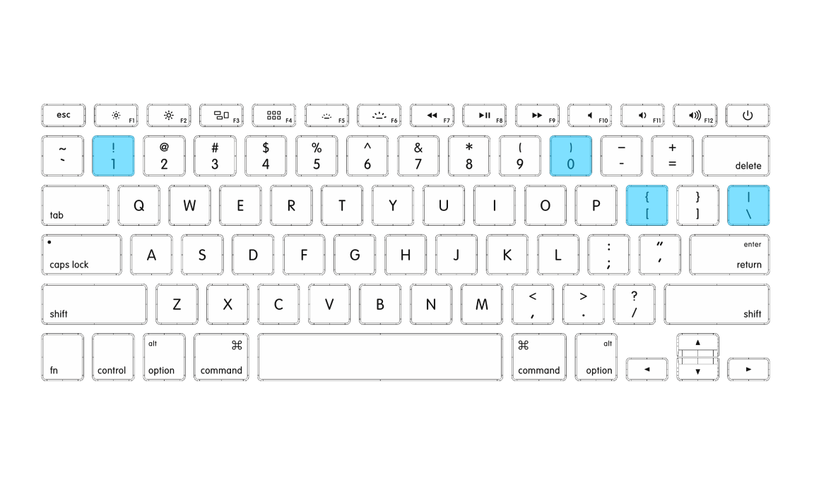
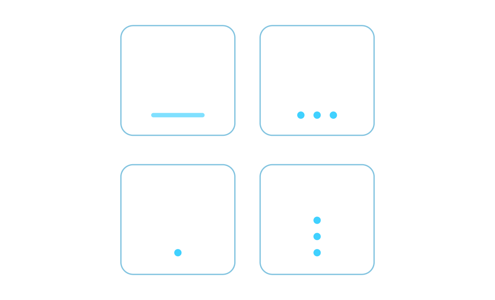

Hardware is probably too big word for what I have in mind. A gadget? Helper?

## Problem

I am learning to touch type. Right now I can pretty much type all words without looking on the keyboard.
Problem starts when I have to write code. Beside typing names for variables, functions and methods I have to type language specyfic syntax:
`: ; " ' { [ ] } - + = ( )` ...at least in JavaScript world.
When I order my 'pinky' finger to press minus keycap, the process to show the minus sign on screen is something like this:
`[]` backspace `0` backspace `-` . Sometimes it takes me more steps to finally have what I want. Or even worse, eventually I have to look at the keyboard...

## Solution

On J and F keycaps on the standard keyboard there is this raised dot or bar. This is an indicator for index fingers to find home row without looking.
Cool idea that is very helpful.
What if there were similar indicators for 'pinky' fingers?😄 On those hard to aim and reach keycaps.

When reaching to that keycap you can instantly know if you are about to press correct key.
There could be indicators only on `0` and `1`. Or there could be some additional on `[` or even `\`.
Of course, there is no limitation to shape. Only one condition: shapes need to be easily distinguishable.

How to modify a keyboard like that?
STICKERS!!!
Black vinyl stickers. Transparent stickers. Anything that will have this 'bump'.

What do you think?  
Is this idea valid?  
Would it help you?

I think it would help me. 😅
