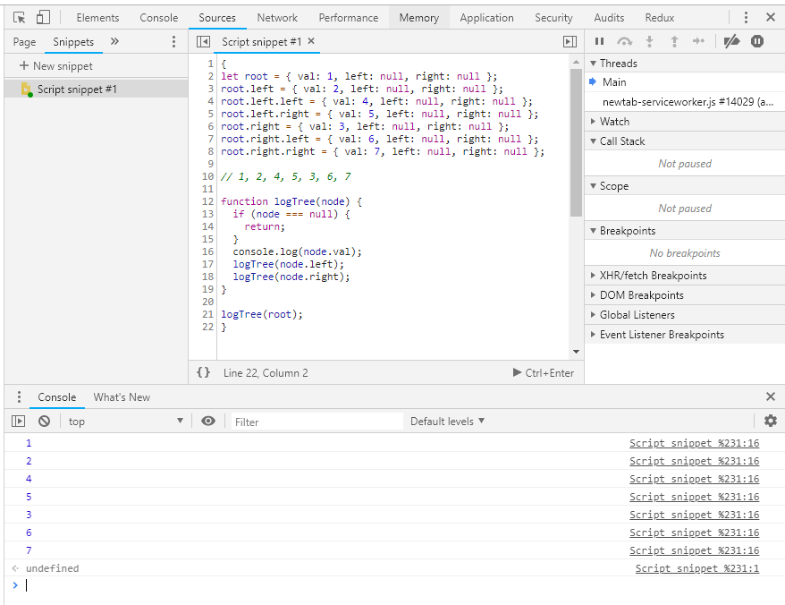
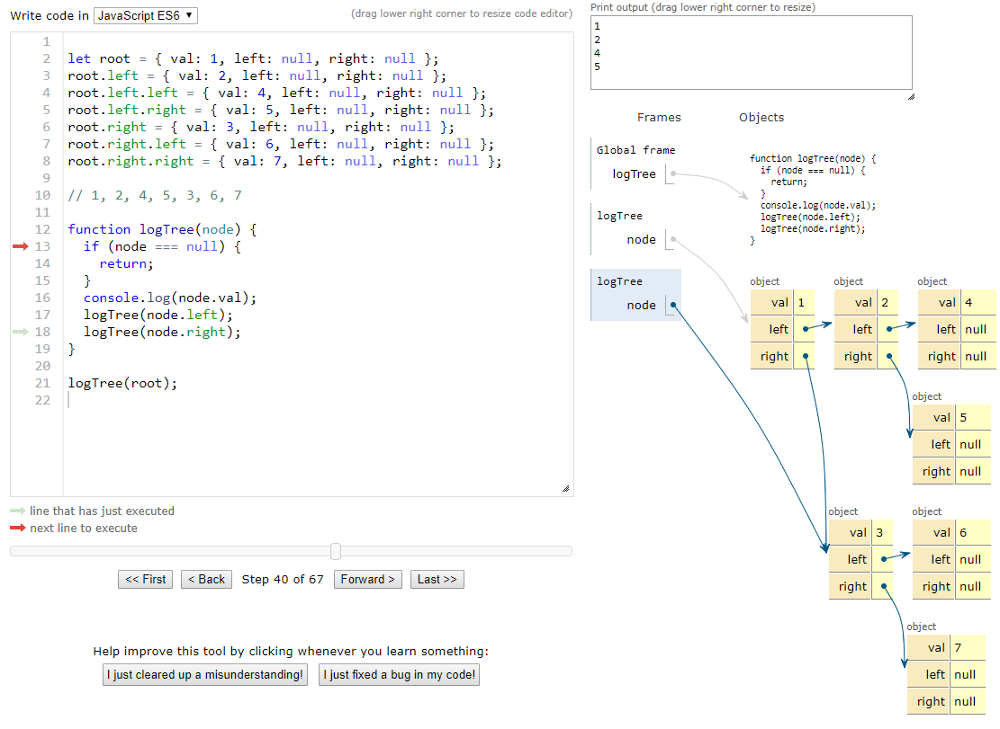

I like to learn new things.  
When I experiment, I need a fast way to run a code snippet, do some debugging and figure out what is working and what is not.  
Depending on the situation and mood 🌅 I switch between these setups:

## VSCode

Most of the time I will write the code in my code_notes repository.
I have the simplest VSCode configuration possible:

```json
{
  "type": "node",
  "request": "launch",
  "name": "single file",
  "program": "${file}"
}
```

With this config, VSCode will run currently opened file in the debugger.  
Just hit `F5` and look for the output in `DEBUG CONSOLE`.  
Of course, you will have all the debugging goodies - read more [here](https://code.visualstudio.com/docs/editor/debugging)

## VSCode + Quokka.js

To have 'live reload' for code evaluation check out [Quokka.js](https://quokkajs.com/)

> Quokka.js is a rapid prototyping playground for JavaScript and TypeScript. It runs your code immediately as you type and displays various execution results in your code editor.

I use it when I am just starting out with an idea.
It really helps to understand what effect has each line of the code.

## Chrome Snippets

Sometimes the quickest way to run JavaScript is in Chrome directly.  

Just open `Developer Tools`, switch to `Sources` tab and create a new code snippet.  
`Snippets` might be hidden under the `>>` icon.
Remember to wrap the code in `{}` to have a new local scope on each run.

## Python Tutor


Don't be fooled by the name! It can run JavaScript also. And it even has a live mode too.  
The cool thing about this tool is that it visualizes what is happening at each step.  
It's great for educational purposes.
[link](http://pythontutor.com/live.html#mode=edit)
