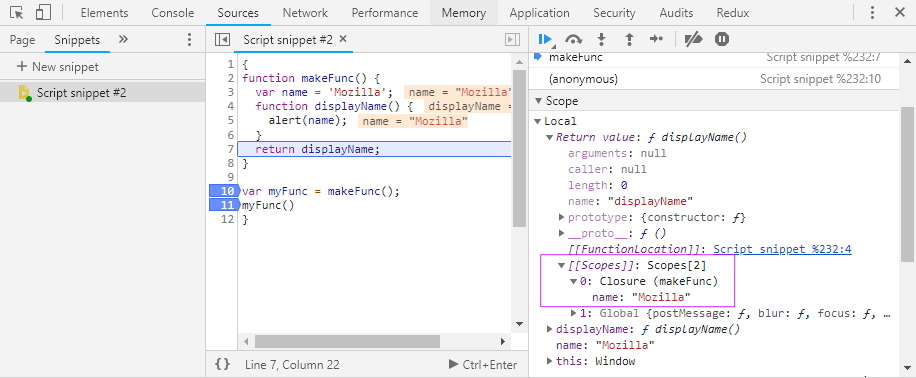

Programming interviews are hard. Live coding during the interview is even harder.  
I have a feeling that as soon as I have to type code in front of another person `myIntelligence -= 10;`

At my current company, lead developers regularly conduct interviews with potential new candidates. There are prepared some sets of questions for JavaScript developers, but there is this one questions that almost always gets asked:

```js
// what will be logged in the console
// and how to fix it to log 0, 1, 2??
for (var i = 0; i < 3; i++) {
  setTimeout(function() {
    console.log(i)
  }, 1000)
}
```

It's a pretty typical question.  
What is so special about it?
Well, in my opinion, these 5 lines touch 3 interesting aspects of JavaScript.

- var, let and const
- closures
- event loop

Let's break it down to see what is happening here.

## var let const

ES6 introduced new variable assignment keywords: `const` and `let`. You probably already know that they are block scoped and `var` is function scoped.  
Some simple cases to illustrate this behavior:

```js
// simplest JavaScript example in the world:
{
  var name = 'maciek'
  let surname = 'chmura'
}
console.log(name) // -> maciek
console.log(surname) // -> surname is not defined

// what's happening under the hood:
var name
{
  let surname
  name = 'maciek'
  surname = 'chmura'
}
console.log(name)
console.log(surname)
```

OK, let’s put this in context of a for loop.

```js
for (var i = 0; i < 3; i++) {
  console.log(i) // -> 0 1 2
}

// what will happen when var is changed to let?
for (let j = 0; j < 3; j++) {
  console.log(j) // -> 0 1 2
}
```

Both loops generate right output. But in some slightly different way. `var` 'jumps' to `global scope` and `let` 'jumps' into the loop, and gets initialized on each iteration.  
It can be illustrated like this:

```js
// var lives here
for (var i = 0; i < 3; i++) {
  console.log(i) // -> 0 1 2
}
console.log(i) // -> 3

for (let j = 0; j < 3; j++) {
  // let is available only from here
  console.log(j) // -> 0 1 2
}
console.log(j) // ReferenceError: j is not defined
```

OK, easy peasy... This is how block scoping works... moving on.

## Closures

The mystical land of JavaScript Closure.
What is the raw definition of a closure?
Lets check [MDN](https://developer.mozilla.org/en-US/docs/Web/JavaScript/Closures)

> A closure is the combination of a function and the lexical environment within which that function was declared.

Please take a deeper look at this article from MDN. Very smart people contribute to this knowledge base, let's trust them :)

- What exactly is this `lexical environment`?
- Does it go away at some point?
- Who and when decides about it?
- How can I control it?

For a long time, I could not wrap my head around it.
It was until I added 2 visual aids to help me understand it.

1. 🎒 A Backpack. I like to think of closures as backpacks of functions. When a function is defined it adds to its backpack all the values it might need in the future.
2. 🚚 A Garbage Collector. A truck that removes old code. Unlike in C language, you don't have to do `malloc()` and `free()`, it will be handled automatically.

When some function has executed and returned a value, we can safely remove this function definition from memory 🚚🗑. The same thing goes for values that are not reachable anymore.  
Things get interesting when a function returns a function.  
I don't want to reinvent new examples and definitions, so I will just add some layer of visual helpers.  
MDN example (with line numbers):

```js
function makeFunc() {
  // 1
  var name = 'Mozilla' // 2
  function displayName() {
    // 3
    alert(name) // 4
  } // 5
  return displayName // 6
} // 7
// 8
var myFunc = makeFunc() // 9
myFunc() // 10
```

Let's imagine a simplified JavaScript interpreter workflow. What JavaScript runtime is ’thinking’ while running code.

- (line 1)`makeFunc` function definition, moving on.
- (9)Declare `myFunc` variable and assign to it the result of running `makeFunc`, execute `makeFunc`
- (1)Jumping into `makeFunc` definition.
- (2)Ok, a variable `name` with value `Mozilla`.
- (3)`displayName` function definition, moving on.
- (4)`return` `displayName` function definition

**First plot twist**. Whole function definition is returned here. There are no () at the end of `displayName`.  
**Second plot twist**. A closure is observed. Where? `displayName` puts into its 🎒 `var name` (it is within lexical scope of `displayName`)



`makeFunc` executed and returned the whole function definition of `displayName` with its closure (a 🎒) holding a reference to a value in `name`.  
The garbage collector can't delete lines 1 to 7 from memory because sometime in the future `myFunc` might get executed, and then `displayName` with its closure will be needed.

- (10) execute `myFunc`

This is how I understand closures.  
Now I can see it!


Let's move to the last part of the puzzle.

## Event Loop

There is no better way to learn about event loop than from amazing [Philip Roberts talk at JSConf EU](https://www.youtube.com/watch?v=8aGhZQkoFbQ).  
Just watch it...  
🤯 mind blowing right?  
OK! Finally, with all the knowledge, let's break down what is happening in the interview question.

```js
for (var i = 0; i < 3; i++) {
  setTimeout(function() {
    console.log(i)
  }, 1000)
}
```

With each iteration of the loop, `setTimeout` sends function with `console.log(i)` to the web APIs and start the countdown.  
In the meantime, we will continue with the loop. Another `console.log(i)` will be pushed to web APIs and so on...  
Loop finished execution. Call Stack is empty.  
In the web APIs, after 1 second `console.log(i)` gets pushed to the Callback Queue. And another one, and another one.

Because the Call Stack is empty, Callback Queue can push its first element to the Call Stack to execute it.  
So the first `console.log(i)` executes.  
It looks for an `i`.  
What is the value of `i`?  
It's 3. From the global scope.

_Why?_

Loop finished its iteration and updated the `i` to 3 at the end.  
var `i` is function scoped (for loop is not a function), and was hoisted outside of the loop to the `global scope`.  
Call Stack is empty again.  
Second `console.log(i)` moves to the Call Stack.  
What is the value of `i`? It's 3 again. It's the same value.


How to fix it to log 0, 1, 2?

One way of fixing it is by changing `var` to `let`.  
Now while looping, each `i` is initialized and assigned a value of current iteration and put into closure (a 🎒) of function that will log it.  
After 1 second, when the Call Stack is empty, Callback Queue will push function with `console.log(i)` and it's closed over value of `i` back to Call Stack and execute it.

0, 1, 2 will get logged respectively.

_Done._

_Next question please._
