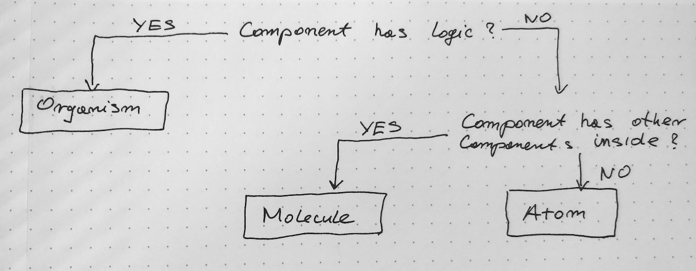

There are many guides on how to structure web apps and React in particular.

- Move files into folders based on Smart/Dumb components.
- Organise them by the Header/Main/Footer
- Or throw everything to Components and combine them in Pages???

I’ve never been fully convinced to use any of these conventions.
And then, about 2 months ago I started a new project. Simple tech stack: React + Express + MySQL.
After a few commits, I had to move the components somewhere.
After a little bit of research, I found something promising.
It's based on 2 resources:

1. [Dan Abramov's official guide](http://react-file-structure.surge.sh/)
2. [Brad Frost's Atomic Design](http://atomicdesign.bradfrost.com/table-of-contents/)

Dan gave me freedom and Brad gave me structure 😅

Atomic Design introduces a new, abstract way to think about project structure. Components are building blocks of an app.
Atoms, molecules, organisms, templates, and pages. This concept brings a breath of fresh air to how we can think about structure.
For my purpose, I used the first 3, but I encourage you to read Brad's guide and adapt it to your liking.

I started with a sketch:


Main idea:  
3 folders: Atoms, Molecules, Organisms  
If the component has logic/state -> move it to Organisms.  
If the component has other components -> move it to Molecules.  
Otherwise, the component is an Atom.

I like the organic analogy. It creates a mental and logical box for React components. If needed, I can add more non-organic folders for Utils, Routes, API, etc.  
A Button will be in Atoms.  
A Form will be in Molecules.  
Component with Hooks will be in Organisms.

```
src/
  Atoms/
    Button
    ProjectName
    ...
  Molecules/
    ControlBar
    DaysList
    ...
  Organisms/
    User
    CreateUser
    ...
  Utils
    formatMonthData.js
```

For now, this works with no flaws with my project. I will reevaluate this concept when my project grows.
