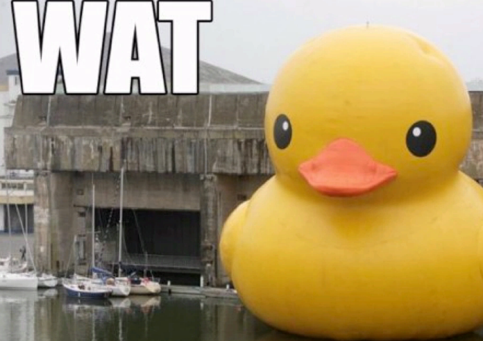
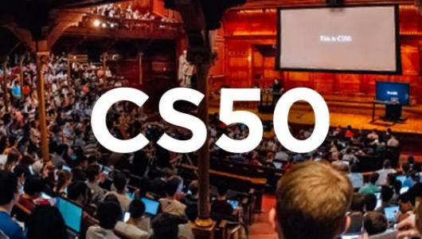

This is the second post of a series about my path of learning JavaScript.
The last post described my opinion about what not to do while learning JS.

*How to learn it then?*

I think learning JavaScript has nothing to do with JavaScript.

...

Let me explain.

Just like my Unnamed Friend advised, I needed to learn how to program. 
In general.

- What are variables, functions, objects, arrays, strings, ints?
- How do computers even work?
- What happens when you type an address to a browser?
- What is a server?
- What is a database?
- Why functions return something?
- What is an algorithm?
- What is a browser API?
- What is AJAX?

A lot of unknowns and no clear starting point, when you just want to make a Todo app in React... 🤦‍♂️

Luckily there is a starting point. And it is an awesome one.

## Part 1: Fundamentals

[CS50](https://www.edx.org/course/cs50s-introduction-to-computer-science)

*An introduction to the intellectual enterprises of computer science and the art of programming.*

Taught by David J. Malan [@davidjmalan](https://twitter.com/davidjmalan) and his team.

I love this course. I would like to do it again and discover everything one more time 😅

For each week you will have a lecture by David
(while watching it, your 💡⚡ 'AHAAAAA' light bulb will shine every few minutes).
Followed up by shorter lecture with coding examples.
You finish each week with a coding project and run it through an automatic test.

You will be exposed to very interesting problems with many technologies.

Here are the topics that were covered in the scope of this course during my take on it.

- Week 1: Introduction to programming in C language. Create 2 CLI programs in C.
- Week 2: Big O, Sorting Algorithms, Binary Search, Recursion. Create 2 cyphering CLI programs with C.
- Week 3: Call Stack, Pointers, Dynamic Memory Allocation. Create a program to manipulate images in C
- Week 4: Structures, Custom Types, Singly-Linked Lists, Hash Tables, Tries, Stack, Queues. Create a spell checker in C.
- Week 5: IP, TCP, HTTP, HTML, CSS
- Week 6: Dynamic Programming, Introduction to Python.
- Week 7: Servers, Python and Flask. Create 2 CLI programs in Python.
- Week 8: Flask, MVC, SQL. Implement a stock-trading website.
- Week 9: JavaScript, DOM, Ajax. Implement a news map app.
- Week 10 and 11: Final Project

After completing it you will have a pretty good understanding of what is needed to build an app.

Suddenly you will not ask: "UGHHHH, why it is coded like that??!!"
And will say: "💡Ahhhh, it is coded like that because..."

## Part 2: Building

Now you are ready to dig into JavaScript.
And the best way to learn is by building.
Some ideas about what to build:

- tic-tac-toe game with vanilla JS
- tic-tac-toe with [React](https://reactjs.org/tutorial/tutorial.html)
*now you know what problems React solve!*
- Node backend with a database on [Heroku](https://www.heroku.com/free)
- React app with data from [Firebase](https://firebase.google.com/)

Depending on how much time you have for learning, this can take from 6 months to a year.

Now you have a solid understanding of what programming is about.
You have a handful of completed projects on GitHub.

## Part 3: Expand your knowledge

[You can dig deeper into JavaScript](https://javascript.info/). 
You can follow this awesome [roadmap](https://roadmap.sh/) made by [@kamranahmedse](https://twitter.com/kamranahmedse).
Build more complex apps.

Go and learn what interest you. 
That's it 😀.  
Have fun!  
