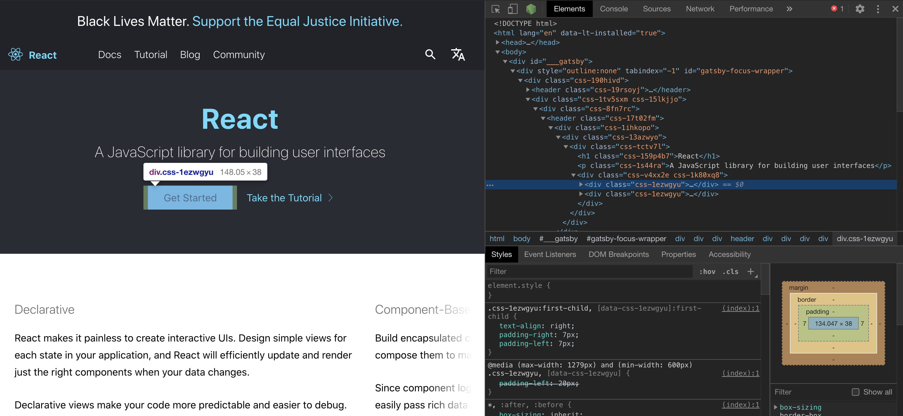
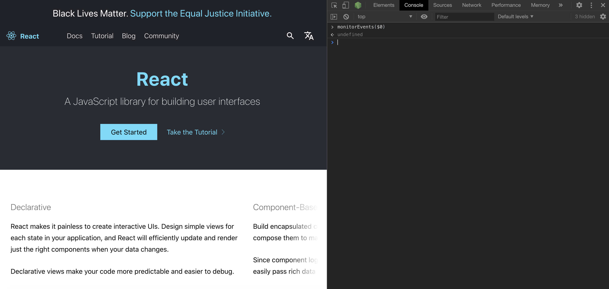
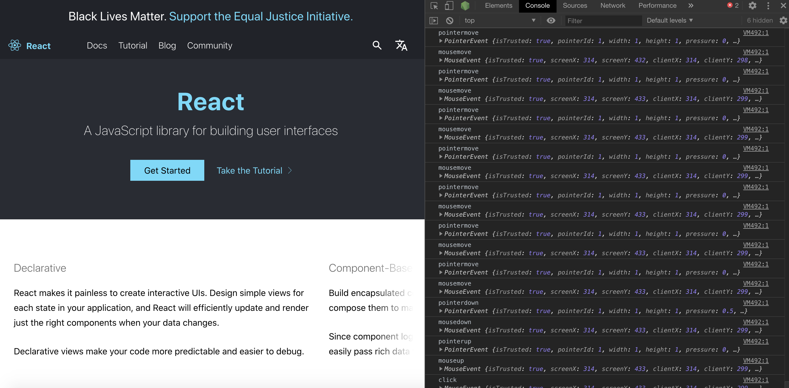

There is an easy way of monitoring all events fired while interacting with a DOM element.

Open dev tools and select element.

While the element is selected, switch to console and type: `monitorEvents($0)`

Interact with the element: hover, click, etc.
The console should print all the events fired.

